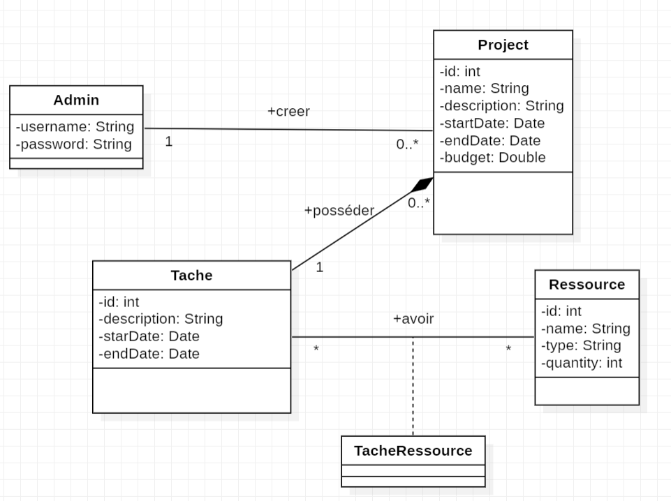

# ConstructionXpert Services Solution

## Description
**ConstructionXpert Services Solution** is a web-based project management application tailored for construction teams. Developed as a full-stack solution, it empowers administrators to efficiently create, manage, and track construction projects, assign tasks to team members, and oversee resource allocation. With a user-friendly interface, the app allows seamless viewing, updating, and deletion of projects, tasks, and resources, ensuring optimized planning and organization of construction workflows.

## Key Features
- **Project Management**: Create, view, update, and delete construction projects, including details such as name, description, start/end dates, and budget.
- **Task Management**: Assign and manage tasks within projects, specifying descriptions, timelines, and required resources.
- **Resource Management**: Add, update, and track resources (e.g., name, type, quantity, supplier info), with automatic quantity adjustments after task assignments.

## Technologies
- **Backend**: Java, Java EE (Servlets, JSP), JDBC, Apache Tomcat
- **Database**: MySQL
- **Frontend**: HTML, CSS (Tailwind), JavaScript
- **Tools**: Git (version control), Figma (mockups)

## UML Diagrams
The following UML diagrams illustrate the application's design and functionality:
1. **Class Diagram**: 
   


2. **Use Case Diagram**: 
   


3. **Sequence Diagram**: 
   

    
## Installation
1. **Prerequisites**:
    - Java JDK 8+
    - Apache Tomcat 10.x
    - MySQL
    - Git
2. **Steps**:
    - Clone the repository:
      ```bash
      git clone : https://github.com/lahcen404/ConstructionXpert.git


 
